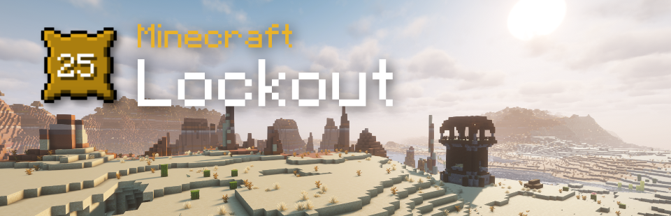

# Lockout Generator


## What is Lockout?
Minecraft Lockout is a game in which two teams compete to complete as many goals as they can on a board of 25 goals. The goals can be as simple as 'Ride Horse' or as challenging as 'Kill Ender Dragon'. Each goal is worth one point and when one team completes a goal, the other team is "locked out" of that goal and can no longer get a point for it. The first team to complete more than half the board wins.

This game was originally invented by SmallAnt and created by AtSign as a Forge mod. This version is a data pack so it can be played in vanilla Minecraft with no extra client-side installations. 

You can find the original mod on curseforge [here](https://www.curseforge.com/minecraft/mc-mods/lockout).
All credit for the concept goes to SmallAnt - [Check out his YouTube!](https://www.youtube.com/@Smallant)

I hope you enjoy!
~Truffle

## How to Generate a Board
This project will generate a data pack for each lockout board. You can either use the GUI applet or the CLI interface. 

There are two different ways to create a board.

balanced - Generates a board with weighted difficulty distribution for optimal gameplay balance. This is the recommended option when starting out.

custom - Generates a user-specified board using a provided list of goal ID numbers


### Generate a Balanced Board (Start Here)
Running "python3 cli.py" in a terminal of your choice will create a random board weighed to a reasonable difficulty. This is the recommended option if you are just starting out or want to start playing quickly.
You can set several options when generating a board. For example, the command below will make a 4x4 board with a maximum difficulty of 6:
```python3 cli.py -s 4 -d 1-6```

For detailed information, run 
```python3 cli.py -h```

The length of your game depends on the board size and the difficulty you choose.
I recommend a 3 or 4 size board for short games (45m-1hr), and 5 or 6 for longer games (1.5-2hrs).
In theory, the board can be as big as you want, although the script may crash if you try to go above 16x16 because there are only so many goals.

Difficulty range is set by any two integers between 1 and 10 separated by a hyphen (-). The larger number (max difficulty) comes second.


### Generate a Custom Board
To manually create a board, you need to make a list of goal ID numbers. You can look through index.py in the source code to see a list of all available goals.

When you have slected your goals, put the ID numbers in a space-separated list.
For example: A0001 A0002 A0003 etc. Do not put the same goal in the list twice, it will cause your data pack not to work properly.
You must have a square number of goals (4, 9, 16, 25, 36, etc.)

Run the command 
```python3 cli.py -b custom <yourlistofgoals>```

Your data pack will generate by default in your Downloads folder.


## Installing the Data Pack and Playing Lockout
To install a data pack, open your Minecraft world folder and find the folder labeled 'datapacks'. Drag the zip file into this folder (no need to extract it), then run /reload in your world.

To play lockout, first install the data pack on your world or on a server. Add players to teams using "/team join 1 <player>" and "/team join 2 <player>".
You can change the colors of the teams by typing "/team modify 1 color <color>".
To start the game, run 
```/function lockout:game/start``` 
If a player joins late, and they can't see the lockout board, add them to a team and have them relog. That should fix the problem.

## Limitations

Since a compass tracker is hard to implement in a data pack, instead you can use "/trigger locate" to see any player's coordinates in the world. In newer versions, you can use the locator bar as well.

There is no lockout board overlay like in the original mod. Press your advancements keybind (defaults to L) to see the lockout board. 

**IMPORTANT: Do not install this data pack on a pre-existing world. Lockout is intended to be played on a new world with a random seed.**

With that being said, there are plenty of benefits to playing in vanilla. You can install any mods you want and your friends can join and play instantly without any tricky client-side setup.

## Playing Blackout

The data pack also allows you to start a Blackout game (same as a lockout except everyone is on the same team and you try to complete the entire board)

To play, follow the same steps as above to generate the data pack and load it into your world. Then run /reload and either click the button in chat that says START BLACKOUT or type 
```/function lockout:game/start_blackout```


## Resource Pack
In order to make some of the goal icons more descriptive, this generator comes with an optional resource pack that utilizes some of the textures from the original lockout mod. You do not have to do any setup besides enabling it on your client (or setting it as the server resource pack).


## Known Issues
Due to data pack limitations, there may be some issues with players logging off during the game, though I've done as much as I can to limit any problems from this. One such issue that may arise is if a player logs out during the game start sequence. If this happens and the player cannot move/jump after the game has started, try running "/execute as <affected_player> run function lockout:game/reset_attributes"


## License
This code is licensed under the terms of the GNU GPLv3 license.
You may use this code for your own personal enjoyment. Do not distribute this code for profit without significant customizations and changes.
