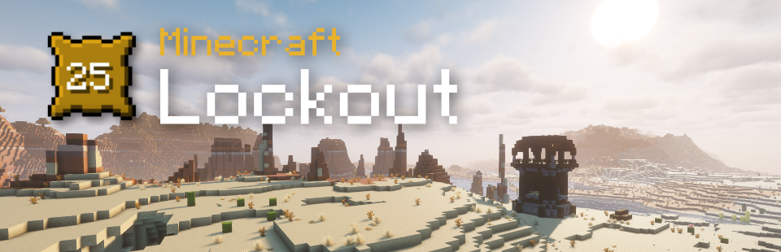

# Truffle's Minecraft Lockout Generator


## What is Lockout?
Lockout is played on a random Minecraft world in survival mode. Two teams try to complete more than half the objectives on a board of typically 25 goals. The goals can be easy like 'Eat Apple' or as challenging as 'Enter End City'. Each goal is worth one point. Once one team completes a goal, the other team is "locked out" of that goal and can no longer earn a point for it. The first team to complete more than half the board wins.

This game was originally invented by SmallAnt and created by AtSign as a Forge mod. You can find the original mod on Curseforge [here](https://www.curseforge.com/minecraft/mc-mods/lockout), although it is no longer receiving updates. There is an [updated version](https://github.com/Specnr/lockout-fabric) for Fabric made by marin774 and specnr. This project recreates lockout in a data pack so that it can be played in 100% vanilla Minecraft. If you are looking for a traditional lockout experience, use one of the mods linked above. If you want to play on vanilla (or any mod loader of your choosing), read on. 

Lockout was originally created by [SmallAnt](https://www.youtube.com/@Smallant)!

I hope you enjoy!

~Truffle


## Installation & Setup
This code generates data packs. Each data pack is one single-use lockout board. Simply generate a board, [load the data pack into your world or server](https://datapack.wiki/guide/installing-a-datapack), add players to teams, and play!


1. Press the green "Code" button, and click "Download ZIP"
2. Extract the ZIP anywhere you like
3. Make sure you have [python](https://www.python.org/) installed on your system ([heres a guide](https://realpython.com/installing-python/))
4. Open the project directory in a terminal 
    - On macOS, right click on the folder in Finder, then click on Services > New Terminal at Folder
    - On Windows, follow [this guide](https://www.wikihow.com/Open-a-Folder-in-Cmd)
    - Linux users should already know how to do this
5. To get started quickly, simply run `python3 lockout.py` and your data pack should appear in your Downloads folder
6. Drag the file into your world's datapacks folder, and you are good to go! No need to unzip.

> [!CAUTION]
> Do not install a lockout data pack on a pre-existing world. Lockout is intended to be played on a new world.


## Customization
There are two different ways to create a board.

- balanced (Generates a board with balanced difficulty. This is the recommended option for beginners.)
- custom (You specify what goals are on your board using a list of goal ID keys)


#### Generate a Balanced Board
Running `python3 lockout.py` in a terminal will create a random 5x5 board of reasonable difficulty. This is the recommended option if you are just starting out or want to start playing quickly.
You can customize several options when generating a board. For example, the command below will make a 4x4 board with a maximum difficulty of 6/10:
```python3 lockout.py -s 4 -d 1-6```

> [!TIP]
> To see the help page, run 
> ```python3 lockout.py --help```

**Size**
The size of the board is controlled by the `-s` flag. In theory, the board can be as big as you want, although the generator may crash if you try to create a board with more goals than exist. I wouldn't recommend going above 10x10. To set the size, use `python3 lockout.py -s <size>`. For example, a 5x5 board is generated with `python3 lockout.py -s 5`, and a 6x6 board is `python3 lockout.py -s 6`.

**Difficulty**
The difficulty range is set by any two integers between 1 and 10 separated by a hyphen (-). The larger number (max difficulty) comes second.

Set the size with `python3 lockout.py -d <min_difficulty>-<max_difficulty>`

For example, running `python3 lockout.py -d 1-3` gives you a very easy board, with goals that are rated between 1/10 and 3/10 difficulty. The world seed is not taken into account when determining difficulty. Some goals may be much harder to complete on some seeds.


#### Generate a Custom Board
You can also manually create a board with a list of goal ID numbers. You can look through index.py to see a complete list of all the available goals.

When you have slected your goals, put the ID numbers in a space-separated list.
For example: A0001 A0002 A0003 etc. Do not put the same goal in the list twice, it will cause problems.
You also must have a square number of goals (4, 9, 16, 25, 36, etc.)

Run the command 
```python3 lockout.py -b custom <yourlistofgoals>```

The data pack will appear in your Downloads folder.


#### Goal Pools
When generating a balanced board, goals are selected randomly from a goal pool. You can find several presets in the goal_pools folder. List available goal pools with `python3 lockout.py -P`.

You can follow the guide in that folder to create your own goal pool. It's essentially a loot table for choosing goals.

To use a custom goal pool, run `python3 lockout.py -p <goal_pool>`

For example, to make a blackout board run `python3 lockout.py -p Blackout`.


## Playing Lockout
To play lockout, install the data pack on your world or on a server. 

Players can use `/trigger join_team set <1 or 2>` to select their team while still in the lobby.
You can manually add players to teams using `/team join 1 <player>` and `/team join 2 <player>`.

To start the game, run 
```/function lockout:game/start``` 
or click the button that says "Start Lockout"

If a player joins late, and they can't see the lockout board, first add them to a team and have them relog.


## Playing Blackout
The data pack also allows you to start a Blackout game. Blackout is cooperative lockout. Complete the entire board to win. Everyone works together.

To play, follow the same steps as above to generate the data pack and load it into your world. Then run `/reload` and either click the button in chat that says "Start Blackout" or type 
```/function lockout:game/start_blackout```


## Limitations
Typically in lockout you have a compass to track players, however a compass is clunky to implement in a data pack. Instead you can use `/trigger locate` at any time to see players' coordinates during the game. In newer Minecraft versions, you can use the locator bar as well. This functionality can be disabed in the preferences menu.

There is no lockout board overlay like in the mod version. Press your advancements keybind (default is L) to see the lockout board. This is a data pack limitation.

With that being said, there are plenty of benefits to playing in vanilla. You can install any mod loader you want and your friends can join and play instantly without any tricky client-side setup.


## Resource Pack
In order to make some of the goal icons more distinguishable, the generator comes with an optional resource pack that utilizes some of the textures from the original lockout mod. You do not have to do any setup besides enabling it on your client. If you know how, you can set it as the server resource pack so players are prompted to download it when they join the lockout server.


## Known Issues
Due to data pack limitations, there may be some issues with players logging off during the game, though I've done as much as I can to limit any problems from this. One such issue that may arise is if a player logs out during the game start sequence. If this happens and the player cannot move/jump after the game has started, try running `/execute as <affected_player> run function lockout:game/reset/attributes`


## License
This code is licensed under the terms of the GNU GPLv3 license.

Derivative works must also be licensed under the GPL.

## Contact Me
If you have any questions, you are welcome to email me at `truffle@vacasound.com` or open a new issue on github.
